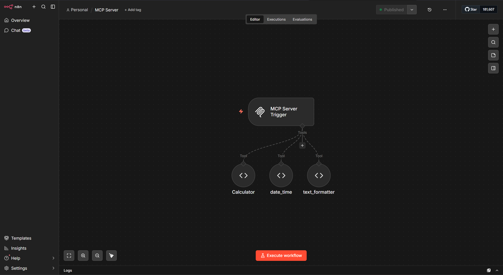
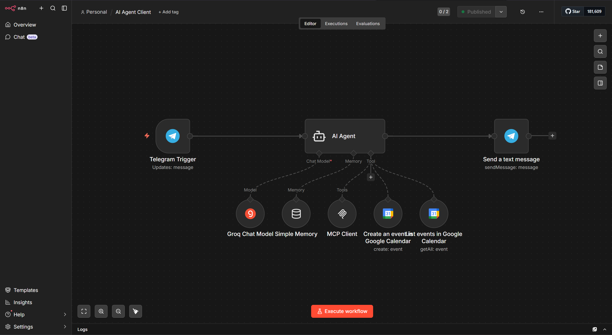
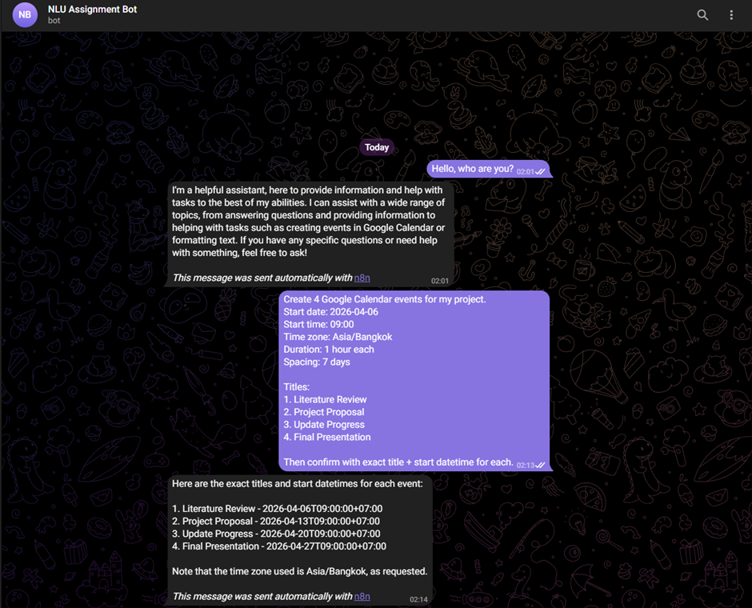
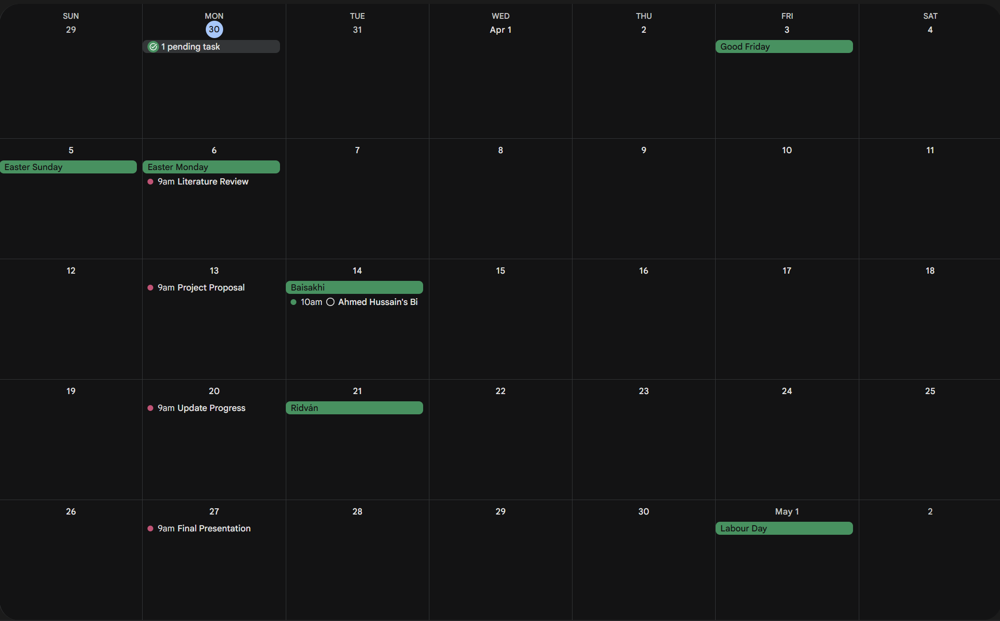
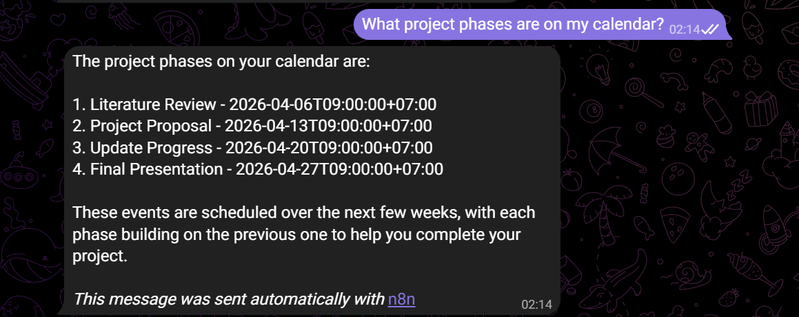
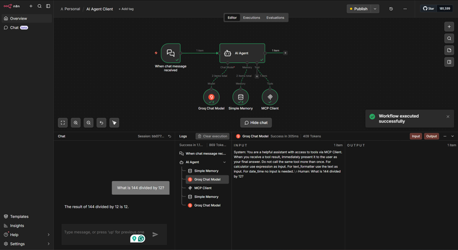
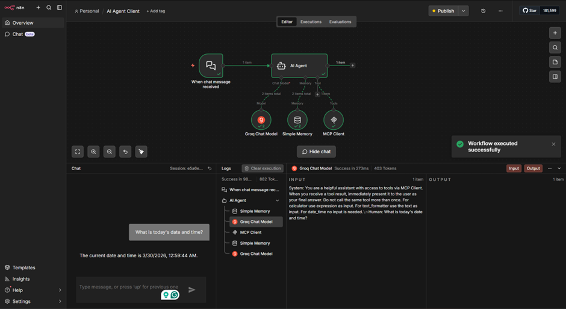
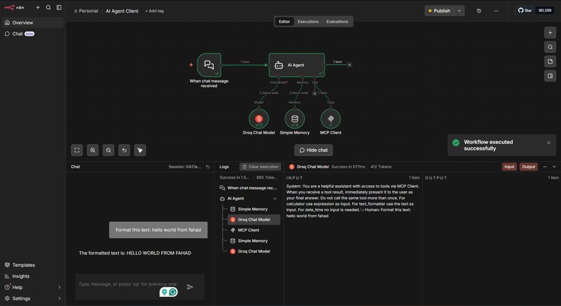
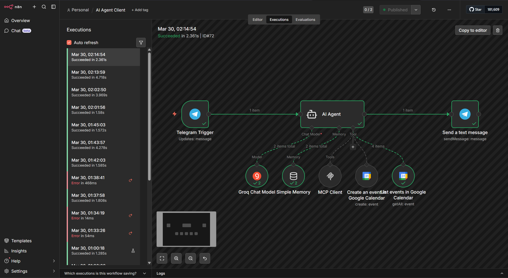
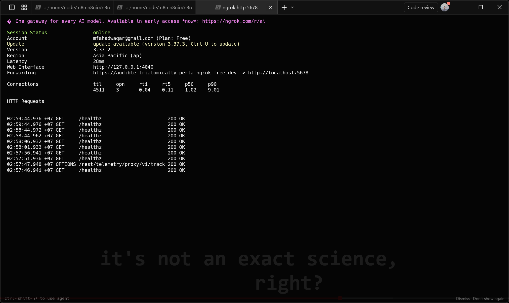

# NLU Assignment 7: MCP Server, AI Agent, and External Tool Integration

**Name**: Muhammad Fahad Waqar  
**Student ID**: st125981  

---

## Overview

This assignment implements a complete n8n-based AI Agent ecosystem with MCP infrastructure. 

---

## Task 1: MCP Infrastructure & Server

### 1.1 Server Deployment

- n8n Docker container running on `localhost:5678`
- ngrok tunnel active providing public HTTPS URL
- Webhook accessible from internet
- Port binding confirmed

### 1.2 MCP Server Workflow

**Workflow**: `MCP-Server-Production`

**Architecture**:
- Webhook POST `/webhook/mcp-server` receives tool requests
- JavaScript Code node routes by `tool_name` parameter
- Returns standardized JSON responses
- Respond to Webhook node returns results to caller

### 1.3 AI Agent Client

**Workflow**: `AI-Agent-Client`

**Components**:
- **Trigger**: Telegram (receives user messages)
- **Memory**: Simple Memory (maintains conversation history)
- **Model**: Google Gemini (gemini-2.0-flash)
- **Tools**: MCP Client, Google Calendar Create, Google Calendar List
- **Output**: Telegram Send Message

**System Prompt**: Instructs agent to use available tools appropriately, especially for project scheduling via Google Calendar.

---

## Task 2: Telegram & Google Calendar Integration

### 2.1 Telegram Bot API

- Bot authenticated with token
- Webhook registered with n8n
- Receives and responds to messages
- Chat ID configured for delivery

### 2.2 Google Calendar Tool

- OAuth credentials authenticated
- Create Event operation: Accepts summary, start, end, timezone
- List Events operation: Retrieves upcoming events
- Timezone: Asia/Bangkok (UTC+7)
- All date/time fields use ISO 8601 format with offset (+07:00)

### 2.3 Project Phase Scheduling

**Requirement**: Create 4 project events 7 days apart, starting from user-specified date

**Implementation**:
1. User sends Telegram message requesting 4 phases with start date
2. AI Agent calls Google Calendar Create Event tool 4 times
3. Events created:
   - Literature Review (Day 0)
   - Project Proposal (Day 7)
   - Update Progress (Day 14)
   - Final Presentation (Day 21)
4. All events: 1-hour duration, 09:00 AM start, Asia/Bangkok timezone

**Verification**: 4 events appear in Google Calendar with correct titles and weekly spacing

### 2.4 Interaction Verification

**Requirement**: Agent can query calendar and confirm scheduled phases

**Implementation**:
1. User asks: "What project phases are on my calendar?"
2. Agent calls Google Calendar List Events tool
3. Agent responds with exact event titles and start datetimes
4. Information matches created events

---

### Task 1 Screenshots

**MCP Server Workflow**

Show: Workflow canvas with Webhook → Code → Respond nodes  
Confirm: Workflow is Active

**AI Agent Workflow**

Show: Full workflow canvas with Telegram Trigger, AI Agent, Send Message  
Show: Tool nodes below (MCP Client, Calendar Create, Calendar List)  
Confirm: Workflow is Published

### Task 2 Screenshots

**Telegram - Create Phases**

Show: User's request to create 4 project phases with start date  
Show: Bot's confirmation listing all 4 events with titles and datetimes

**Google Calendar - 4 Events**

Show: Calendar view showing all 4 created events  
Confirm: 7-day spacing between events  
Visible titles: Literature Review, Project Proposal, Update Progress, Final Presentation

**Telegram - Query Response**

- Calculator: User asks "What is 144 divided by 12?" → Bot returns calculated result

- DateTime Query: User asks "What is today's date and time?" → Bot returns current timestamp with day of week

- Text Processing: User input "hello world from fahad" → Bot response "HELLO WORLD FROM FAHAD" (TextProcessor tool)

Demonstrates: All 3 MCP tools (TextProcessor, DateTime, Calculator) are working correctly through Telegram

**n8n Executions**

Show: Execution log showing multiple Create Event tool calls  
Confirm: At least 4 separate calls with different event titles

### Infrastructure Verification

**ngrok Tunnel Status**

Shows: ngrok session status confirming
Demonstrates: Public HTTPS tunnel is established and n8n server is accessible from internet

---